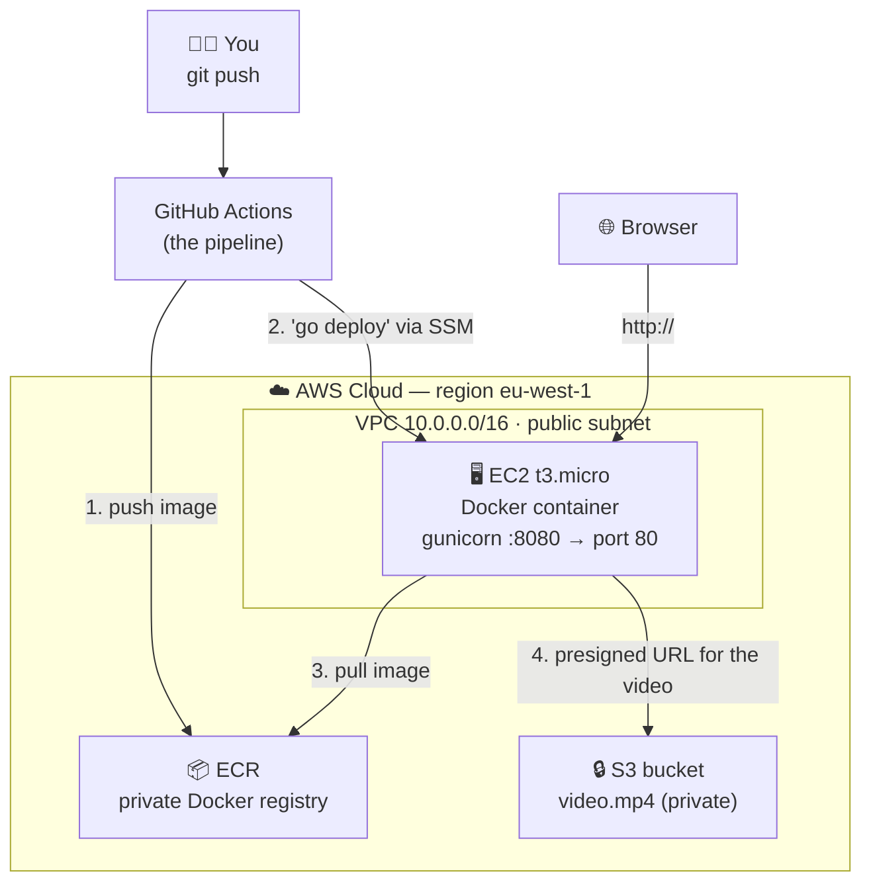
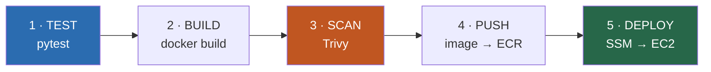

# AWS DevOps Workshop — from `git push` to a live app

Welcome! This repository is a **complete, working DevOps project**, small enough to
read in one sitting but real enough to teach you how software actually gets shipped
in a company.

The app itself is deliberately boring: a small Python web page that plays a video.
The *interesting* part is everything around it — how the code is tested, packaged,
scanned for security holes, and deployed to the cloud **automatically, every time
someone pushes to `main`**, with zero manual clicking and zero passwords lying around.

By the end you will have:

- a real AWS environment you created with **code** (not by clicking in the console),
- a **Docker image** of your app stored in a private registry,
- two **CI/CD pipelines** that do all the work for you,
- a public URL where your app is running. 🎬

> **Who is this for?** Someone who has never done DevOps before, or is in their first
> weeks. You should be comfortable in a terminal and know what `git push` does.
> Everything else is explained.

---

## Table of contents

1. [What is DevOps, in one minute](#1-what-is-devops-in-one-minute)
2. [The architecture](#2-the-architecture)
3. [The tools you'll meet](#3-the-tools-youll-meet)
4. [Prerequisites — what to install before you start](#4-prerequisites--what-to-install-before-you-start)
5. [Step-by-step: make it run](#5-step-by-step-make-it-run)
6. [The application (`app/`)](#6-the-application-app)
7. [The Dockerfile — turning the app into a container](#7-the-dockerfile--turning-the-app-into-a-container)
8. [The infrastructure (`terraform/`) — what actually gets created in AWS](#8-the-infrastructure-terraform--what-actually-gets-created-in-aws)
9. [The pipelines (`.github/workflows/`) — the heart of CI/CD](#9-the-pipelines-githubworkflows--the-heart-of-cicd)
10. [The DevOps principles hiding in this repo](#10-the-devops-principles-hiding-in-this-repo)
11. [Running it locally (no AWS needed)](#11-running-it-locally-no-aws-needed)
12. [Clean up — do not skip this](#12-clean-up--do-not-skip-this)
13. [Troubleshooting](#13-troubleshooting)
14. [Exercises — make it your own](#14-exercises--make-it-your-own)

---

## 1. What is DevOps, in one minute

Before DevOps, a developer wrote code and "threw it over the wall" to an operations
team, who manually copied it onto a server. It was slow, it was inconsistent, and
when it broke nobody knew whose fault it was.

DevOps says: **the path from a developer's laptop to production should be automated,
repeatable, and owned by the whole team.** Three ideas do most of the work:

| Idea | What it means | Where you'll see it here |
|---|---|---|
| **CI** — Continuous Integration | Every change is automatically built and tested the moment it's pushed. Bugs are caught in minutes, not weeks. | `test` and `build-and-scan` jobs in [cicd.yml](.github/workflows/cicd.yml) |
| **CD** — Continuous Deployment | If the tests pass, the change is automatically released. No human copies files to a server. | `deploy` job in [cicd.yml](.github/workflows/cicd.yml) |
| **IaC** — Infrastructure as Code | Servers, networks and permissions are described in files, kept in git, and created by a tool. You can destroy and recreate the whole environment with one command. | everything in [terraform/](terraform/) |

A CI/CD **pipeline** is just a list of steps that run automatically. If any step
fails, the pipeline stops and nothing is deployed. That's the safety net.

---

## 2. The architecture


Read the picture as two flows:

- **Blue arrows (top)** — the *delivery* flow: your code travels from your laptop
  → GitHub → tests → Docker image → security scan → registry → the server → the user.
- **Orange arrows (bottom)** — the *infrastructure*: Terraform creates the AWS
  environment (network, firewall, permissions, server, registry) that the delivery
  flow lands in.

Here's the same thing as a simplified diagram of what runs where:



**What each box is:**

- **EC2** is a virtual machine — a rented computer in Amazon's data centre. Ours is a
  `t3.micro` (free tier). It runs Docker, and Docker runs our app.
- **ECR** (Elastic Container Registry) is a private warehouse for Docker images.
  The pipeline puts images in; the server takes them out.
- **S3** is Amazon's file storage. Our video lives there in a bucket that is
  **completely private** — no one on the internet can read it directly.
- **VPC** is our own private network inside AWS, with a firewall (security group)
  that only opens port 80 (web traffic) to the world.

**How the video gets to the viewer without making the bucket public:** the EC2 server
has an AWS *identity* (an IAM role) that is allowed to read that one bucket. When you
open the page, the app asks S3 for a **presigned URL** — a temporary link that works
for one hour and then expires. The browser plays the video from that link. No
passwords are stored in the app, and the bucket is never opened to the public.

---

## 3. The tools you'll meet

| Tool | What it does | Why we use it |
|---|---|---|
| **Python + Flask** | The web app itself | Something to deploy |
| **pytest** | Runs unit tests | Proves the code works before we ship it |
| **Docker** | Packages the app + its dependencies into one portable image | "Works on my machine" → works everywhere |
| **Trivy** | Scans the Docker image for known security vulnerabilities | Catches security problems *before* production |
| **Terraform** | Creates AWS resources from code | Reproducible, reviewable, destroyable infrastructure |
| **GitHub Actions** | Runs the pipelines | The automation engine |
| **AWS** (EC2, ECR, S3, IAM, SSM) | Where everything runs | The cloud |

---

## 4. Prerequisites — what to install before you start

### Accounts you need

1. **A GitHub account** and a repository to push this code to.
2. **An AWS account.** Everything here fits in the **Free Tier**, but a card is
   required at sign-up. (You will destroy everything at the end — see [step 12](#12-clean-up--do-not-skip-this).)

### Software to install on your machine

| Tool | Check it works | Install |
|---|---|---|
| **git** | `git --version` | usually pre-installed |
| **AWS CLI v2** | `aws --version` | [docs](https://docs.aws.amazon.com/cli/latest/userguide/getting-started-install.html) · macOS: `brew install awscli` |
| **Terraform ≥ 1.5** | `terraform -version` | [docs](https://developer.hashicorp.com/terraform/install) · macOS: `brew install terraform` |
| **Python 3.12** | `python3 --version` | only needed to run the app/tests locally |
| **Docker** | `docker --version` | *optional* — the pipeline builds images for you |

### Connect the AWS CLI to your account

Your laptop needs AWS credentials **for two one-time setup steps only** (after that,
the pipelines authenticate themselves — see below). Pick one:

**Option A — IAM Identity Center / SSO (recommended, no permanent keys on disk):**
```bash
aws configure sso     # one-time setup
aws sso login         # temporary credentials that expire on their own
```

**Option B — an IAM user with AdministratorAccess (fine for a workshop):**
```bash
aws configure         # paste your Access Key ID + Secret Access Key
```

Verify it worked:
```bash
aws sts get-caller-identity     # should print your account ID
```

> ⚠️ **The golden rule of this workshop:** an AWS *access key* is a password. It never
> goes into git, never into GitHub, never into `terraform.tfvars`. If you used Option B,
> **delete that access key** once the pipelines are running.

### 🔑 How the pipelines log into AWS without any password

This confuses everybody at first, so let's do it now.

The pipeline needs to talk to AWS. The old way was to paste an access key into GitHub
— which means a permanent password sitting in a website, waiting to leak. Instead we
use **OIDC**:

1. GitHub Actions generates a short-lived, cryptographically signed token that says
   *"I am a workflow running in the repo `you/your-repo`."*
2. AWS has been told (by Terraform, in [github_oidc.tf](terraform/github_oidc.tf))
   to **trust tokens from that specific repository**.
3. AWS swaps the token for temporary credentials that expire in about an hour.

So the only things you store in GitHub are **role ARNs** — public identifiers, like a
username with no password. Nothing secret ever leaves AWS. This is exactly how real
companies do it.

---

## 5. Step-by-step: make it run

### Step 1 — Get the code into your own GitHub repo

```bash
git clone <this-repo> aws-devops-workshop
cd aws-devops-workshop
git remote set-url origin git@github.com:<your-user>/<your-repo>.git
git push -u origin main
```

### Step 2 — Create the Terraform "state backend" (once per AWS account)

Terraform remembers what it created in a file called **state**. If that file lives on
your laptop, the pipeline can't see it — and two people applying at once would corrupt
it. So we store the state in **S3**, with a **DynamoDB** table acting as a lock (only
one `apply` at a time). [scripts/bootstrap-backend.sh](scripts/bootstrap-backend.sh)
creates both:

```bash
export AWS_REGION=eu-west-1
export TF_STATE_BUCKET=<your-initials>-devops-workshop-tfstate   # must be globally unique
./scripts/bootstrap-backend.sh
```

### Step 3 — Configure Terraform

```bash
cd terraform
cp backend.hcl.example backend.hcl              # ← set your state bucket name
cp terraform.tfvars.example terraform.tfvars    # ← your settings
```

In `terraform.tfvars` you **must** set two values:

```hcl
my_ip_cidr  = "203.0.113.5/32"          # your public IP: curl -s https://checkip.amazonaws.com
github_repo = "your-user/your-repo"     # so AWS knows which repo to trust for OIDC
```

Then initialise Terraform (this downloads the AWS provider and connects to the state):

```bash
terraform init -backend-config=backend.hcl
```

> Both `terraform.tfvars` and `backend.hcl` are **git-ignored** on purpose — your real
> values stay on your machine.

### Step 4 — Create the infrastructure (the first `apply` runs from your laptop)

Why locally? Because this `apply` **creates the very IAM roles the pipeline will use**,
and a role cannot create itself. Chicken and egg — you're the chicken, once.

```bash
terraform apply     # read the plan, then type: yes
```

Terraform prints a list of **outputs** when it finishes. You'll need these:

| Output | What you do with it |
|---|---|
| `github_actions_role_arn` | → GitHub **secret** `AWS_ROLE_ARN` (app pipeline) |
| `github_terraform_role_arn` | → GitHub **secret** `AWS_TF_ROLE_ARN` (infra pipeline) |
| `video_bucket_name` | where you upload the video |
| `app_url` | your app's URL (works after the first deploy) |

### Step 5 — Upload the video to S3

The app streams the video from the private bucket, so put a file there. Drop any MP4
into `assets/video.mp4` (video files are git-ignored — **big binaries belong in S3, not
in git**), then upload it:

```bash
BUCKET=$(terraform output -raw video_bucket_name)
aws s3 cp ../assets/video.mp4 "s3://$BUCKET/video.mp4"
```

> Prefer Terraform to do the upload? Set `video_source_path = "../assets/video.mp4"` in
> `terraform.tfvars` and re-apply.

### Step 6 — Give the pipelines their AWS access

In GitHub: **Settings → Secrets and variables → Actions**

**Secrets** (paste the values Terraform printed):
- `AWS_ROLE_ARN` = `github_actions_role_arn`
- `AWS_TF_ROLE_ARN` = `github_terraform_role_arn`

**Variables** (not secret — these are just names):
- `TF_STATE_BUCKET` = your state bucket
- `TF_LOCK_TABLE` = `devops-workshop-tf-locks`
- `MY_IP_CIDR` = your IP CIDR *(only used if you enable SSH)*

### Step 7 — Push, and watch the robot work

```bash
git commit --allow-empty -m "trigger my first deploy" && git push
```

Open the **Actions** tab in GitHub. You'll see three jobs run in order:
`Lint & Test` → `Build, Scan & Push Image` → `Deploy to EC2`.

### Step 8 — Open your app 🎬

```bash
terraform output app_url
```

Open that URL. The page plays the video from your private S3 bucket, and the footer
shows the **git commit SHA** that produced the running container and the container's
hostname. That footer is your proof: *this exact commit is what's live.*

---

## 6. The application (`app/`)

```
app/
├── app.py            # the whole application — ~90 lines
├── requirements.txt  # Flask, gunicorn, boto3
├── templates/
│   └── index.html    # the page
├── static/
│   ├── style.css
│   └── image.png     # video poster
├── Dockerfile        # how to package it
└── .dockerignore     # what to keep OUT of the image
```

[app.py](app/app.py) has exactly two routes:

- **`/`** — renders the page and asks S3 for a fresh presigned video URL.
- **`/health`** — returns `{"status": "healthy"}`. This exists purely for the
  machines: Docker calls it to check the container is alive, and a load balancer
  would too. **Every production service should have a health endpoint.**

Two beginner-relevant details in that file:

**Configuration comes from environment variables**, never hardcoded:

```python
VIDEO_BUCKET = os.environ.get("VIDEO_BUCKET", "")
APP_VERSION  = os.environ.get("APP_VERSION", "dev")
```

This is the *12-factor* principle: **build the image once, configure it per
environment.** The same image can run in dev, staging and prod — only the env vars
change. You never rebuild just to change a setting.

**It degrades gracefully.** If no bucket is configured (local dev, or the tests),
it falls back to a public video URL. If presigning fails, it logs the error and uses
the fallback rather than showing users a 500 error page.

[tests/test_app.py](tests/test_app.py) covers both routes and all three video-URL
paths (no bucket → fallback, bucket → presigned, presign fails → fallback). Notice the
tests use a **fake** S3 client — a unit test must never need real AWS credentials or a
network connection. That's what makes it fast enough to run on every single push.

---

## 7. The Dockerfile — turning the app into a container

A **container** is your app plus everything it needs to run (Python, libraries, files)
sealed into one package called an **image**. Ship the image, and it behaves identically
on your laptop, in CI, and on the server.

[app/Dockerfile](app/Dockerfile) is a recipe read top to bottom. Here's what each part
is doing and *why*:

```dockerfile
FROM python:3.12-slim
```
**Start from a base image.** `slim` is a stripped-down Linux with Python. Smaller image
= faster to pull = fewer installed packages = **fewer security vulnerabilities** for
Trivy to find. Choosing a small base is a security decision, not just a size one.

```dockerfile
ENV PYTHONUNBUFFERED=1 ...
```
Makes Python print logs immediately instead of buffering them, so `docker logs` shows
you what's happening in real time.

```dockerfile
COPY requirements.txt .
RUN pip install --no-cache-dir -r requirements.txt
COPY . .
```
**Why copy `requirements.txt` before the code?** Docker caches each step as a *layer*
and reuses it if nothing changed. Dependencies change rarely; your code changes
constantly. By installing dependencies first, a code-only change reuses the cached
`pip install` layer and the build takes seconds instead of minutes. **Order your
Dockerfile from least-changing to most-changing.**

```dockerfile
RUN useradd ... appuser
USER appuser
```
**Run as a non-root user.** By default a container runs as root; if someone breaks into
your app they'd have root inside the container. This is a one-line hardening step and
you should do it in every image you ever build.

```dockerfile
HEALTHCHECK ... CMD python -c "...urlopen('http://localhost:8080/health')"
```
Docker calls `/health` every 30 seconds. If it stops answering, Docker marks the
container unhealthy — the machine notices your app is broken before your users do.

```dockerfile
CMD ["gunicorn", "--bind", "0.0.0.0:8080", "--workers", "2", "app:app"]
```
**The command that starts the app.** Note it's **gunicorn**, not `flask run`. Flask's
built-in server is a development toy — single-threaded and explicitly not for
production. Gunicorn is a real WSGI server that handles multiple requests in parallel
(2 worker processes here — plenty for a t3.micro).

`0.0.0.0` (not `localhost`) means "listen on all network interfaces" — otherwise the
app would only be reachable from *inside* the container and no one could connect.

Finally, [.dockerignore](app/.dockerignore) keeps `tests/`, `.git/`, caches, etc. **out**
of the image: smaller, faster, and no accidental leaking of files into production.

---

## 8. The infrastructure (`terraform/`) — what actually gets created in AWS

### How Terraform works, in three sentences

You *declare* what you want ("I want one server, one bucket") in `.tf` files.
Terraform compares your files to a **state** file (what exists now) and works out the
difference. `terraform plan` shows you that difference; `terraform apply` makes it real.

You never click around in the AWS console. Your infrastructure is code, so it can be
reviewed in a pull request, rolled back with git, and rebuilt from scratch in minutes.

### File by file — what each one creates

| File | Resources it creates | In plain English |
|---|---|---|
| [versions.tf](terraform/versions.tf) | provider config + S3 **remote state backend** | Which AWS region, which provider version, and where the state file lives. Also applies default tags (`Project`, `Environment`, `Owner`) to **every** resource so you can find and bill them later. |
| [variables.tf](terraform/variables.tf) | *(no resources)* | The knobs: region, project name, instance type, your IP, etc. Change a value here instead of editing code in ten places. |
| [network.tf](terraform/network.tf) | **VPC**, **public subnet**, **internet gateway**, **route table** | Your own private network in AWS, plus the door to the internet. The route table says "anything going to the internet, leave through that door." |
| [security.tf](terraform/security.tf) | **security group** | The firewall around the server. Port **80** (web) open to everyone; port **22** (SSH) open **only to your IP**, and only if you asked for an SSH key. Everything else: blocked. |
| [ec2.tf](terraform/ec2.tf) | **EC2 instance**, **Elastic IP** | The virtual machine. On first boot it installs Docker (that's the `user_data` script). The Elastic IP is a **fixed** public address, so your app's URL doesn't change if the machine restarts. The disk is encrypted and IMDSv2 is enforced (a security hardening that blocks a common credential-theft attack). |
| [s3.tf](terraform/s3.tf) | **S3 bucket** (private, versioned, encrypted), optional **video object**, **IAM policy**, 2 **SSM parameters** | Where the video lives. Public access is fully blocked; versioning means an accidental overwrite is recoverable; the IAM policy lets the EC2 server read **only** this bucket's objects. The bucket name gets a random suffix (S3 names are globally unique), so Terraform publishes the name to **SSM Parameter Store** for the pipeline to look up — nothing is hardcoded. |
| [ecr_iam.tf](terraform/ecr_iam.tf) | **ECR repository** + lifecycle policy, **IAM role & instance profile** for EC2 | The private Docker registry (keeping only the last 10 images, to control cost), and the identity the server runs as. That role can: pull from ECR, be managed by SSM, and read the video object. Nothing more — **least privilege**. |
| [github_oidc.tf](terraform/github_oidc.tf) | **OIDC provider**, **IAM role** for the app pipeline | The trust relationship that lets GitHub Actions log into AWS with no password. This role can push images to ECR and send a deploy command to the instance — that's all it can do. |
| [github_terraform.tf](terraform/github_terraform.tf) | **IAM role** for the infra pipeline | A second role for the *infrastructure* pipeline. It has broad (`AdministratorAccess`) permissions because it manages everything — in a real company you'd narrow this and require human approval before `apply`. |
| [outputs.tf](terraform/outputs.tf) | *(no resources)* | The values Terraform prints at the end: your `app_url`, the role ARNs, the bucket name. |

### Two roles, two pipelines — why?

Notice there are **two** OIDC roles. The app pipeline's role can push a Docker image
and restart a container; it *cannot* delete your database or create IAM users. If that
pipeline were ever compromised, the blast radius is tiny. **Separating permissions by
job is what "least privilege" means in practice.**

---

## 9. The pipelines (`.github/workflows/`) — the heart of CI/CD

A GitHub Actions workflow is a YAML file describing **jobs**, each made of **steps**.
Jobs run on a fresh, throwaway Linux machine that GitHub gives you for free.
`needs:` chains them so a job only runs if the previous one **succeeded** — that's the
whole safety mechanism: *a failure anywhere stops the deploy.*

### Pipeline A — the app: [cicd.yml](.github/workflows/cicd.yml)

**Triggers:** every push to `main`, and every pull request targeting `main`.



#### Stage 1 — `test` (Lint & Test)
Checks out the code, installs Python 3.12 and the dependencies, and runs `pytest`.

**This runs on pull requests too**, and it's the cheapest, fastest gate: it takes ~20
seconds and it runs *before anything is built*. **Fail fast** — never spend three
minutes building an image for code that doesn't pass its tests.

#### Stage 2 — `build-and-scan` (Build, Scan & Push Image)
Runs only on a push to `main` (`needs: test`, so only if the tests passed).

1. **Authenticate to AWS via OIDC** — no keys, remember.
2. **Compute the image tag:** `${GITHUB_SHA::7}` — the first 7 characters of the git
   commit hash. So an image is tagged e.g. `a1b2c3d`. This is a big deal:
   **every image traces back to exactly one commit.** Never deploy `latest` and hope.
3. **`docker build`** the image.
4. **Trivy scan** — scans the image for known vulnerabilities (CVEs) in the OS packages
   and Python libraries. Configured with `exit-code: 1` and `severity: HIGH,CRITICAL`,
   which means **the pipeline fails and nothing is deployed if a serious vulnerability
   is found.** This is called **shift-left security**: find problems in CI, in minutes,
   not in production, in the news. (`ignore-unfixed: true` means it won't fail you for
   vulnerabilities that have no patch available yet — otherwise you'd be permanently
   blocked on something you can't fix.)
5. **Push to ECR** — only a scanned, tested image ever reaches the registry.

#### Stage 3 — `deploy` (Deploy to EC2)
1. Finds the EC2 instance **by its `Name` tag**, not a hardcoded ID (IDs change when
   you recreate the box; tags don't).
2. Reads the video bucket name and key from **SSM Parameter Store** — the values
   Terraform published. The pipeline and the infrastructure stay in sync without anyone
   copy-pasting.
3. Sends a command to the server using **SSM Run Command**. Read that again: **there is
   no SSH in this deploy.** No SSH key in GitHub, no port 22 open to CI. AWS delivers
   the command to an agent already running on the box. This is how modern deploys work.

The command it sends is just Docker:
```bash
docker pull <image>                      # get the new version
docker rm -f workshop-app || true        # stop the old container
docker run -d --name workshop-app \
  --restart unless-stopped -p 80:8080 \
  -e VIDEO_BUCKET=... -e APP_VERSION=... <image>   # start the new one
```
`-p 80:8080` maps the container's port 8080 to the machine's port 80, so visitors
reach it on a plain `http://` URL. `--restart unless-stopped` means Docker brings the
app back up if the server reboots.

4. **It waits for the result and checks it.** If the command failed, the job fails
   (`[ "$STATUS" = "Success" ] || exit 1`). A deploy step that doesn't verify its own
   outcome is worse than no deploy step — it lies to you.

> `concurrency:` at the top of the file prevents two deploys of the same branch from
> running at the same time and racing each other.

### Pipeline B — the infrastructure: [infra.yml](.github/workflows/infra.yml)

**Triggers:** only when something under `terraform/**` changes.

| Stage | What it does | Why it matters |
|---|---|---|
| `fmt -check` | Fails if the code isn't formatted | Style is never a code-review argument again |
| `init` | Connects to the shared S3 state | Everyone works from the same source of truth |
| `validate` | Checks the syntax is valid | Catch typos before touching AWS |
| `plan` | **Shows exactly what would change**, and posts it as a comment on your pull request | 👀 A human reads the plan and approves it *before* AWS is touched |
| `apply` | Applies **the exact plan file** that was just reviewed — but **only on push to `main`** | You get what you reviewed, nothing else |

This is the single most important pattern in infrastructure work: **plan on the pull
request, apply on merge.** Nobody ever runs `terraform apply` on production from their
laptop while guessing what it will do.

---

## 10. The DevOps principles hiding in this repo

Once you've read the code, go back and spot each of these — this is the actual
curriculum:

- **Everything as code.** App, infrastructure, and pipelines all live in git. If it's
  not in the repo, it doesn't exist.
- **Automate the path to production.** No human copies a file to a server. Ever.
- **Fail fast, fail cheap.** Tests (seconds) run before builds (minutes) run before
  deploys. The pipeline stops at the first failure.
- **Build once, configure per environment.** One image; behaviour changes via env vars.
- **Immutable, traceable deployments.** Image tag = git SHA. Every running container
  points to exactly one commit — and the app footer shows it.
- **Shift-left security.** Trivy in CI + ECR scan-on-push. Non-root container. A
  vulnerable image cannot be deployed.
- **Least privilege everywhere.** Two separate CI roles. The EC2 role can read exactly
  one bucket. SSH is closed to everyone but you (and unused).
- **No long-lived secrets.** OIDC instead of access keys; presigned URLs instead of
  public buckets; IAM roles instead of credentials baked into the image.
- **Discover config, don't hardcode it.** Bucket name → SSM. Instance → found by tag.
- **Review before you change infrastructure.** `plan` on the PR, `apply` on merge.
- **Everything is disposable.** `terraform destroy` and `terraform apply` gets it all
  back, identically.

---

## 11. Running it locally (no AWS needed)

You can run the app with zero AWS involvement — with no bucket configured it plays a
public fallback video:

```bash
cd app
pip install -r requirements.txt
gunicorn --bind 0.0.0.0:8080 app:app
# → http://localhost:8080
```

Run the tests exactly like CI does:

```bash
pip install -r app/requirements.txt -r tests/requirements-dev.txt
pytest tests/ -v
```

Build and run the container, exactly like the pipeline does:

```bash
docker build -t workshop ./app
docker run -p 8080:8080 workshop
```

Scan your image the way the pipeline does, before you push:

```bash
docker run --rm -v /var/run/docker.sock:/var/run/docker.sock \
  aquasec/trivy image --severity HIGH,CRITICAL workshop
```

---

## 12. Clean up — do not skip this

AWS charges for resources that exist, whether or not you use them. One command removes
everything Terraform created:

```bash
cd terraform && terraform destroy
```

The sneaky one is the **Elastic IP**: AWS charges for a reserved public IP that isn't
attached to a *running* instance — so simply stopping the instance is not enough.
Destroy it. (The state bucket and lock table from step 2 are outside Terraform; delete
them by hand if you're completely done.)

---

## 13. Troubleshooting

| Symptom | Cause & fix |
|---|---|
| Infra pipeline fails at `init` | You skipped the bootstrap script, or the repo variables `TF_STATE_BUCKET` / `TF_LOCK_TABLE` aren't set. |
| Infra pipeline fails at `fmt -check` | Run `terraform fmt -recursive` and commit. |
| `Error: could not assume role` in Actions | The `AWS_ROLE_ARN` / `AWS_TF_ROLE_ARN` secret is missing or wrong, or `github_repo` in `terraform.tfvars` doesn't match your actual repo. |
| Trivy fails the build | **That's the feature working.** Update the base image (`python:3.12-slim`) or the dependency it flagged. Don't disable the scan. |
| Deploy can't find the instance | It searches for the `Name` tag `devops-workshop-dev-web`. If you changed `project_name` or `environment`, update `ECR_REPOSITORY`, `INSTANCE_NAME_TAG` and `VIDEO_PARAM_PREFIX` in [cicd.yml](.github/workflows/cicd.yml) to match `<project>-<env>`. |
| Page loads but the video doesn't play | The object isn't in the bucket. Do step 5 (`aws s3 cp`). The app reads the fixed key `video.mp4`. |
| `403` pulling from ECR on the box | The EC2 IAM role isn't attached, or the instance has no outbound internet. |
| Page won't load at all | Give it a minute after the first deploy (the instance installs Docker on first boot). Then check the security group allows port 80. |

**Debugging a running container** — connect with SSM Session Manager (browser shell, no
SSH key needed): EC2 console → select the instance → **Connect** → *Session Manager*.

```bash
sudo docker ps                    # is the container running?
sudo docker logs workshop-app     # what did it say?
curl localhost/health             # does it answer?
```

---

## 14. Exercises — make it your own

1. **Break a test** on purpose, push, and watch the pipeline refuse to deploy.
2. **Change the page** (edit `templates/index.html`), push, and watch the footer version
   change to your new commit SHA.
3. **Add a `/version` route** returning the app version, plus a test for it.
4. **Downgrade the base image** to an older Python and watch Trivy fail the build.
5. **Change `instance_type`** in `terraform.tfvars`, open a PR, and read the `plan`
   comment carefully — notice that Terraform tells you it will *replace* the instance.
6. **Harder:** put an Application Load Balancer in front of the instance and run two of
   them. This is where the `/health` endpoint stops being decorative.

Happy shipping. 🚀
